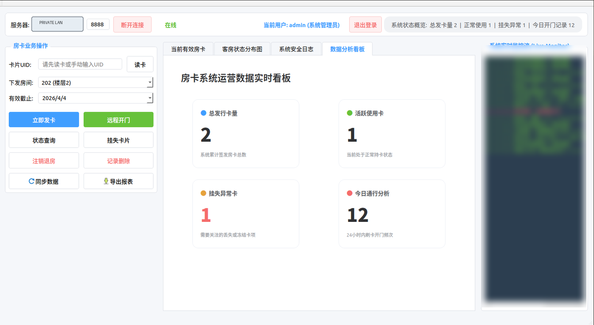
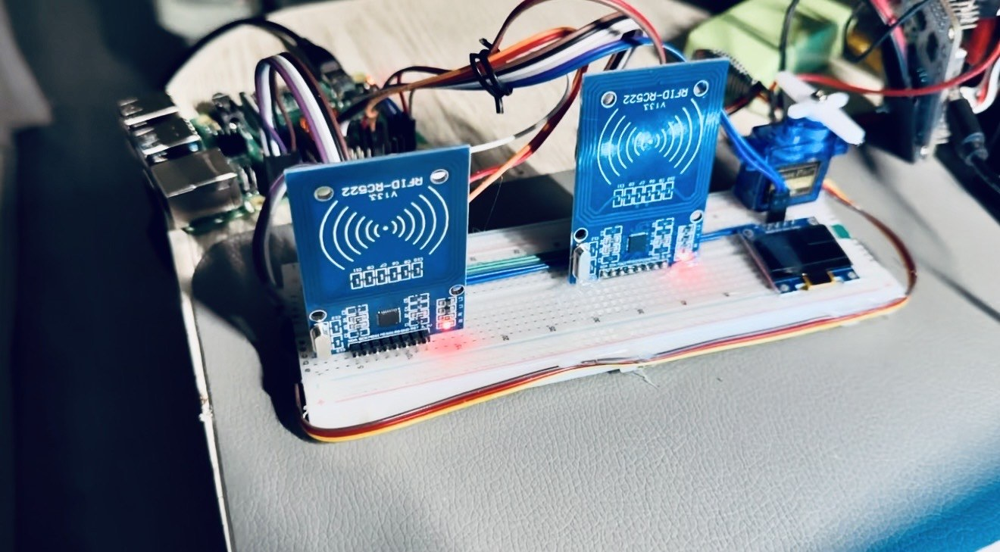
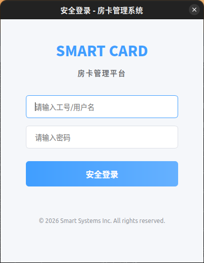
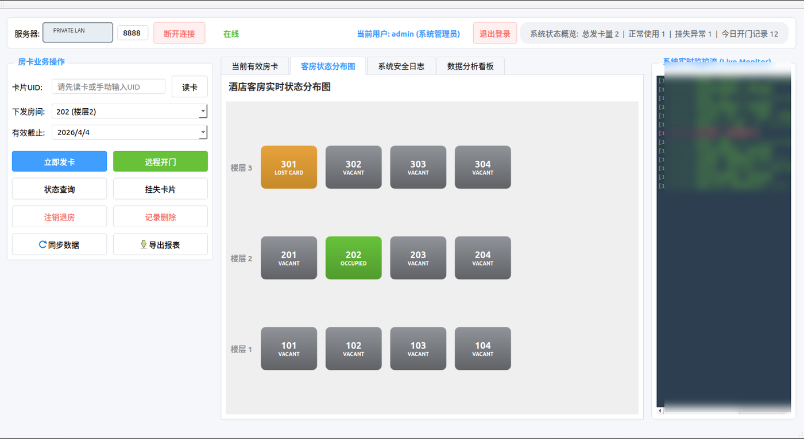
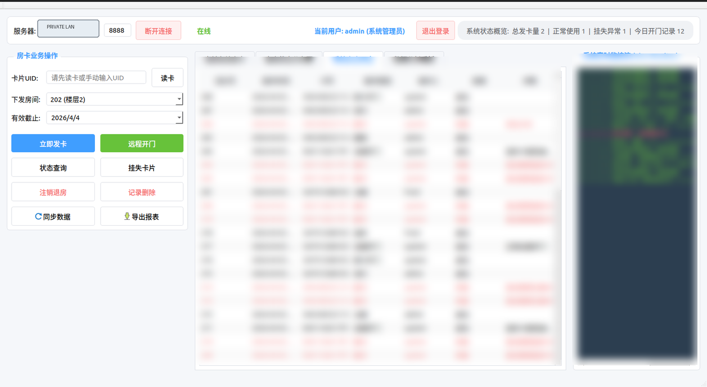

# 基于树莓派的 RFID 房卡管理系统

一个教学原型：连接两块 RC522 读卡器、树莓派 Python 服务、MariaDB、SG90 执行器和 Qt/C++ 管理客户端。

[](https://github.com/rongyishuaige7/raspberry-pi-rfid-room-card-system/actions/workflows/validate.yml)
[](LICENSE)



上图为项目仪表盘截图；其中的私有局域网地址和 RFID UID 已移除或模糊，图片元数据已清除。

## 项目照片与资料

这里整理了项目照片、界面截图和相关资料；文件处理说明见 [MEDIA_EVIDENCE](docs/MEDIA_EVIDENCE.md)。



## 原型包含的内容

- 独立的 SPI0 前台读卡器和 SPI1 CE2 门侧读卡器；
- 房卡发放、查询、挂失、注销和删除；
- 后台门侧刷卡轮询与 SG90 PWM 任务；
- 管理员、前台和保洁三个服务端角色策略；
- 房态、操作日志、统计、CSV 导出和 Qt 仪表盘；
- 基于环境变量的 MariaDB 配置和交互式账号创建；
- 可选 GPIO LED、有源蜂鸣器和 SSD1306 OLED 反馈；
- 带 SPI 设备和 VersionReg 检查的 RC522 诊断脚本。

本仓库适合学习小型多层硬件系统如何协同工作；它**不是**生产级酒店门锁或安全门禁产品。

## 架构

```text
Qt 5/6 桌面管理客户端
        │ 自定义换行分隔 TCP，默认端口 8888
        ▼
树莓派 Python 服务 ───── MariaDB
        │
        ├── RC522 #1 / SPI0 CE0：前台发卡/读卡
        ├── RC522 #2 / SPI1 CE2：门侧轮询
        ├── SG90 / GPIO18：PWM 动作序列，无位置反馈
        ├── LED + 有源蜂鸣器：可选状态反馈
        └── SSD1306 / I2C1：可选本地显示
```

## 项目界面

| 登录界面 | 房间地图 |
|:--:|:--:|
|  |  |

<details>
<summary>已脱敏的审计日志视图</summary>



</details>

这些截图拍摄于 2026-04-03。

## 仓库结构

```text
client/                 Qt/C++ 管理客户端
hardware/               树莓派服务端和硬件驱动
database/init.sql       MariaDB Schema 与示例房间种子数据
hardware/BOM.csv        根据源码整理的物料清单
hardware/wiring-diagram.svg
assets/screenshots/     已脱敏的项目界面截图
tests/                  不依赖硬件的 Python 合同测试
docs/                   协议、验证、状态与来源说明
scripts/                用户创建脚本和仓库门禁
```

## 安全默认配置

### 1. 安装树莓派依赖

```bash
sudo apt update
sudo apt install -y mariadb-server python3-venv python3-dev build-essential
python3 -m venv .venv
. .venv/bin/activate
pip install -r hardware/requirements.txt
# 可选 OLED：
pip install -r hardware/requirements-optional.txt
```

`mfrc522` 使用 GPL-3.0 许可证，本仓库未内置该依赖。重新分发设备镜像前，请审阅 [第三方声明](THIRD_PARTY_NOTICES.md)。

### 2. 初始化 MariaDB，不创建默认凭据

```bash
sudo systemctl enable --now mariadb
sudo mysql < database/init.sql
```

请自行创建最小权限数据库账号，并使用足够长的随机密码。不要把真实密码写入 Git 或公开 Shell 记录：

```sql
CREATE USER 'roomcard'@'localhost' IDENTIFIED BY '<YOUR_RANDOM_DATABASE_PASSWORD>';
GRANT SELECT, INSERT, UPDATE, DELETE ON room_card_system.* TO 'roomcard'@'localhost';
FLUSH PRIVILEGES;
```

在受保护的服务环境中设置数据库变量。`.env.example` 说明变量名称；`.env` 已被 Git 忽略。

```bash
export ROOMCARD_DB_USER=roomcard
export ROOMCARD_DB_PASSWORD='<YOUR_RANDOM_DATABASE_PASSWORD>'
```

以交互方式创建首个应用管理员。密码通过 `getpass` 读取，不会作为命令行参数传入：

```bash
python3 scripts/create_user.py local-admin --role admin
```

公开 Schema 包含示例房间号，但**不包含应用用户和默认密码**。

### 3. 启用接口并检查硬件

通过 `raspi-config` 启用 SPI0。第二块读卡器需要在当前 Raspberry Pi OS 的 `/boot/firmware/config.txt` 中添加以下内容，然后重启：

```text
dtoverlay=spi1-3cs
```

确认 `/dev/spidev0.0` 和 `/dev/spidev1.2` 存在，再分别运行读卡器诊断：

```bash
sudo .venv/bin/python hardware/test_rfid.py --raw
sudo .venv/bin/python hardware/test_rfid.py --door --raw
```

请参阅 [HARDWARE.md](HARDWARE.md) 和[接线边界图](hardware/wiring-diagram.svg)。RC522 使用 3.3 V；舵机需要稳定的 5 V 供电并与树莓派共地。

### 4. 启动服务端

默认只监听回环地址，适用于本地测试或隧道：

```bash
sudo -E .venv/bin/python hardware/server.py
```

如需让同一**隔离可信局域网**内的 Qt 客户端访问，请显式选择加入：

```bash
export ROOMCARD_BIND_HOST=0.0.0.0
sudo -E .venv/bin/python hardware/server.py
```

该协议没有 TLS。请勿将 `8888` 端口暴露到公网。

### 5. 构建 Qt 客户端

Qt 6：

```bash
mkdir -p build/client
cd build/client
qmake6 ../../client/card-manager.pro
make -j"$(nproc)"
./card-manager
```

Qt 5 可配合相应开发包使用 `qmake`。提示时请输入实际 Raspberry Pi 地址；未硬编码任何私网 IP。

## 协议与安全语义

客户端为兼容既有协议，会将密码哈希一次后通过自定义 TCP 链路发送。服务端存储加盐 PBKDF2 衍生值，但网络观察者仍可能重放传输的摘要。见 [PROTOCOL.md](docs/PROTOCOL.md) 和 [SECURITY.md](SECURITY.md)。

远程开门响应仅表示命令已下发：

```json
{
  "code": 202,
  "msg": "开门任务已下发；未确认舵机完成动作",
  "actuation_confirmed": false
}
```

SG90 路径没有位置传感器或门锁状态反馈。RC522 UID 可被复制，不应被视为高可信度凭据。

## 验证

```bash
bash scripts/verify.sh
```

该门禁会执行敏感信息/本地数据扫描、仓库检查、Python 编译、12 个单元测试，以及干净的 Qt 5/6 qmake 构建。CI 会重复同一组检查，但不会假装拥有 Raspberry Pi 硬件。

参阅：

- [验证说明与当前结果](docs/VERIFICATION.md)
-
- [源码来源与排除项](docs/SOURCE_PROVENANCE.md)
- [物料清单](hardware/BOM.csv)

## 已知限制

- 当前提交尚未在保留的 Raspberry Pi/双 RC522 原型上重新运行。
- CI 不会访问 GPIO、SPI、MariaDB、RC522、SG90、OLED、LED 或蜂鸣器硬件。
- 没有 TLS、重放保护、登录限流、锁定策略、防拆检测或硬件支持的凭据。
- SG90 PWM 时序为开环控制，不能确认门已到达请求状态。
- 精确的 Raspberry Pi 版本、电源、蜂鸣器驱动、LED 电阻、外壳和线束仍需实体确认。
- 未公开当前实物照片或演示视频。

## 许可证

原始仓库材料采用 [MIT License](LICENSE)。依赖项保留各自许可证；详见 [第三方声明](THIRD_PARTY_NOTICES.md)。
